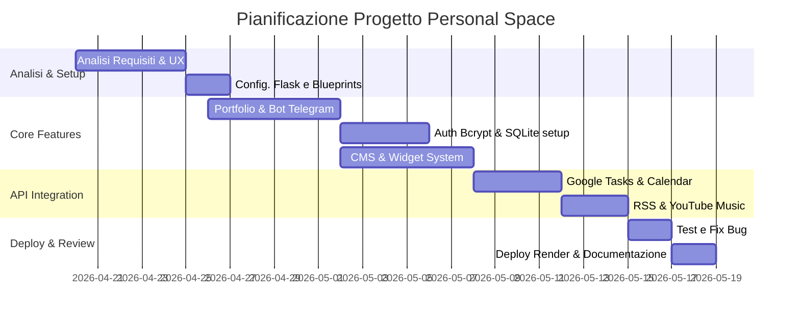
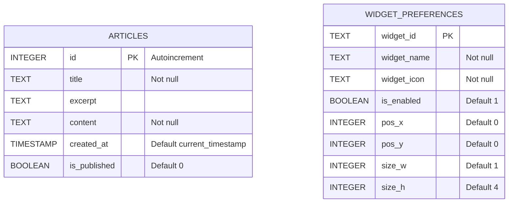
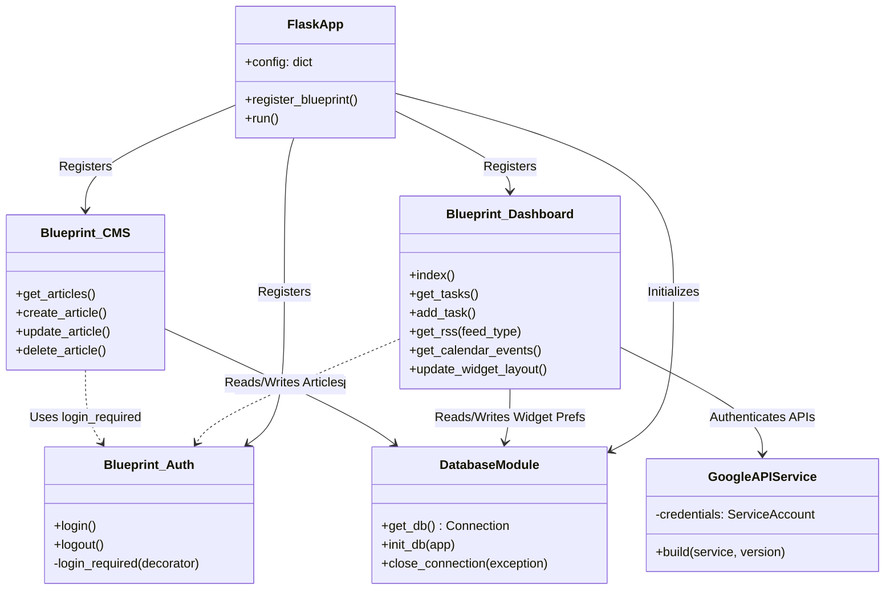

# Documento dei Requisiti

## Introduzione
Questo documento definisce i requisiti per il progetto scolastico di fine anno per il modulo `03_Sviluppo_Web_e_Database` (e TPSIT/Sistemi e Reti). Nato come progetto personale, Personal Space è un'applicazione web ibrida che funge sia da portfolio pubblico per la presentazione delle competenze, sia da dashboard privata modulare per la produttività personale. 

**Nota Architetturale:** A differenza delle classiche web application multi-utente, il sistema è progettato per un singolo amministratore. Per questo motivo, si è scelto di gestire l'autenticazione tramite validazione hash su variabile d'ambiente e di utilizzare un database SQLite leggero unito a storage JSON, ottimizzando le prestazioni ed evitando la complessità superflua di un RDBMS relazionale.

## Obiettivi generali
*   Presentare i propri progetti, competenze e articoli tramite un **portfolio pubblico** accessibile a chiunque.
*   Fornire un'**area riservata (Dashboard)** protetta da autenticazione forte (hash `bcrypt`).
*   Permettere la personalizzazione dell'area di lavoro attivando o disattivando dinamicamente i widget di interesse.
*   Sincronizzare e gestire impegni e attività personali integrando le API ufficiali di **Google Tasks** e **Google Calendar**.
*   Aggregare notizie e aggiornamenti esterni in tempo reale tramite parsing server-side di **feed RSS XML** (es. Bloomberg, NASA).
*   Permettere la gestione e riproduzione di playlist musicali integrando **YouTube Music API** in modo invisibile per il browser.
*   Fornire un **CMS interno** per la creazione e pubblicazione dinamica di articoli visibili sul portfolio.

## Stakeholder e attori

| Stakeholder | Ruolo | Interesse |
| :--- | :--- | :--- |
| **Studente/Sviluppatore** | Sviluppatore | Dimostrare competenze Full-Stack, integrazione API complesse e cura dell'UX/UI. |
| **Docente/Valutatore** | Valutatore | Valutare la qualità architetturale, la sicurezza (es. password non in chiaro) e l'efficacia del codice. |
| **Utente Finale** | Visitatore/Admin | Navigare il portfolio o gestire fluidamente la propria produttività tramite la dashboard. |

### Livelli di accesso
*   **Visitatore:** Utente non autenticato. Può unicamente visualizzare la landing page, leggere gli articoli pubblici del blog e inviare messaggi tramite il form di contatto.
*   **Amministratore (Single-User):** Utente autenticato. Ha accesso completo alla dashboard, ai widget, all'integrazione Google/YouTube e al CMS.

## Requisiti funzionali

**Area Portfolio (Visitatore)**
1.  **REQ-P01:** Il sistema mostra una landing page statica con le informazioni personali e i progetti.
2.  **REQ-P02:** Il sistema permette di visualizzare la lista degli articoli del blog contrassegnati come "pubblicati".
3.  **REQ-P03:** Il sistema fornisce un form di contatto che invia messaggi direttamente al bot Telegram dell'amministratore.

**Area Autenticazione (Sicurezza)**
4.  **REQ-A01:** Il sistema verifica le credenziali di accesso confrontando la password inserita con un hash `bcrypt` salvato nelle variabili d'ambiente.
5.  **REQ-A02:** Il sistema gestisce le sessioni HTTP e garantisce un logout sicuro.

**Area Dashboard & Produttività (Amministratore)**
6.  **REQ-D01:** Il sistema permette di abilitare/disabilitare i singoli widget tramite un menu laterale.
7.  **REQ-D02:** Il sistema salva dinamicamente le preferenze di abilitazione dei widget sul database SQLite in background.
8.  **REQ-D03:** Il sistema mostra, aggiunge, modifica ed elimina task sincronizzandoli in tempo reale con **Google Tasks API**.
9.  **REQ-D04:** Il sistema mostra gli eventi imminenti e permette di aggiungere nuovi appuntamenti su **Google Calendar**.
10. **REQ-D05:** Il sistema effettua il parsing XML di Feed RSS esterni ed espone un'API JSON pulita per la lettura delle ultime notizie.
11. **REQ-D06:** Il sistema estrapola le playlist personali dell'amministratore tramite le librerie `ytmusicapi`.
12. **REQ-D07 (CMS):** Il sistema espone un pannello per creare, modificare, eliminare e gestire la visibilità degli articoli del blog.

### User Stories
*   **Come Visitatore**, voglio consultare la sezione blog e leggere gli articoli, così posso approfondire le conoscenze tecniche dell'autore.
*   **Come Visitatore**, voglio inviare un messaggio tramite il form, così da poter stabilire un contatto diretto e ricevere una risposta.
*   **Come Amministratore**, voglio poter nascondere i widget che non utilizzo, così da mantenere la mia area di lavoro pulita e concentrarmi sulle informazioni essenziali.
*   **Come Amministratore**, voglio aggiungere rapidamente un task dalla dashboard, così che sia immediatamente salvato e visibile anche sull'app mobile di Google Tasks.
*   **Come Amministratore**, voglio scrivere una bozza di un articolo dal CMS e decidere in un secondo momento se pubblicarlo, così da poter preparare i contenuti con calma.

## Requisiti non funzionali

*   **Sicurezza:** Implementazione di meccanismi crittografici per le password (nessun testo in chiaro salvato) tramite l'algoritmo **Bcrypt**. Protezione intrinseca delle route sensibili tramite decoratore backend `@login_required`. Archiviazione dei segreti API (Google Service Account, chiavi Render, Bot Telegram) strettamente in variabili d'ambiente e secret files ignorati dal controllo di versione.
*   **Architettura Backend:** Sviluppo basato sul pattern **Application Factory** e sull'uso intensivo dei **Flask Blueprints** per separare nettamente le aree dell'applicazione (Auth, Portfolio, Dashboard, CMS, Music).
*   **Asincronismo e Real-time (AJAX):** Tutte le operazioni della dashboard (lettura feed, update layout, gestione task) avvengono in background tramite `Fetch API` JavaScript, garantendo un'esperienza fluida da "Single Page Application" all'interno della dashboard, senza mai ricaricare la pagina.
*   **Persistenza Dati Ibrida:** Utilizzo di **SQLite** (`database.db`) con Row Factory per gestire dati strutturati (Articoli CMS, Coordinate Layout Widget) combinato a un approccio stateless per i dati provenienti in tempo reale dalle API esterne.
*   **Deploy:** Piena compatibilità di esecuzione in container o PaaS moderni (es. **Render.com**) tramite application server di produzione WSGI (`gunicorn`).
*   **UI/UX Adattiva:** Design responsive vanilla CSS con variabili custom (`:root`), supporto al tema Chiaro/Scuro integrato e layout a griglia flessibile.

## Casi d'uso

| ID | Nome Caso d'Uso | Attore |
| :--- | :--- | :--- |
| **UC01** | Visualizzazione Portfolio e Blog | Visitatore, Amministratore |
| **UC02** | Invio Messaggio Telegram | Visitatore |
| **UC03** | Accesso alla Dashboard (Login) | Amministratore |
| **UC04** | Disconnessione (Logout) | Amministratore |
| **UC05** | Attivazione/Disattivazione Widget | Amministratore |
| **UC06** | Gestione Task (CRUD) | Amministratore |
| **UC07** | Aggiunta Evento Calendario | Amministratore |
| **UC08** | Gestione Articoli CMS | Amministratore |
| **UC09** | Consultazione Meteo Locale | Amministratore |
| **UC10** | Lettura Notizie RSS | Amministratore |
| **UC11** | Salvataggio Appunti Rapidi (Scratchpad) | Amministratore |
| **UC12** | Riproduzione YouTube Music | Amministratore |

### Descrizione dei Casi d'Uso

*   **UC01 Visualizzazione Portfolio e Blog:** L'utente naviga sulle route pubbliche (`/` o `/blog`). Il sistema estrae dal database SQLite unicamente gli articoli contrassegnati con `is_published=1` e renderizza i template Jinja2 relativi.
*   **UC02 Invio Messaggio Telegram:** L'utente compila nome, email e testo. Il frontend effettua una POST verso `/api/contact`. Il backend riceve i dati JSON, forma un messaggio di testo e lo inoltra tramite richiesta HTTP POST all'API ufficiale di Telegram bot, restituendo un feedback in caso di successo.
*   **UC03 Accesso alla Dashboard:** L'utente tenta l'accesso all'area protetta e viene reindirizzato alla pagina di login. Inserisce la password; il backend esegue `bcrypt.checkpw` contro l'hash in `.env`. Se la verifica ha successo, la sessione viene inizializzata (`session['logged_in'] = True`) e l'utente reindirizzato.
*   **UC05 Attivazione/Disattivazione Widget:** L'amministratore interagisce con un menu toggle per nascondere o mostrare i widget. Il frontend invia lo stato aggiornato all'endpoint API e il database salva la preferenza nella tabella `widget_preferences`.
*   **UC06 Gestione Task:** L'utente scrive un nuovo obiettivo. Il frontend esegue una chiamata REST. Il backend inoltra la richiesta autenticata (via Service Account `secrets/credentials.json`) alle API Google Tasks, riceve la conferma, formatta la data in RFC 3339 e risponde al frontend per aggiornare la UI.
*   **UC07 Aggiunta Evento Calendario:** L'utente compila i campi per un nuovo evento e il sistema lo sincronizza con Google Calendar.
*   **UC08 Gestione Articoli CMS:** L'utente accede al CMS per creare o modificare articoli del blog.
*   **UC09 Consultazione Meteo Locale:** L'utente visualizza le informazioni meteo aggiornate automaticamente tramite le API di Open-Meteo in base alla posizione.
*   **UC10 Lettura Notizie RSS:** Il sistema esegue il parsing XML dei feed impostati e mostra all'utente gli ultimi articoli.
*   **UC11 Salvataggio Appunti Rapidi:** L'utente annota testi veloci nello Scratchpad, i quali vengono salvati localmente.
*   **UC12 Riproduzione YouTube Music:** L'utente interagisce con il widget per visualizzare e ascoltare le playlist estratte dal proprio account tramite ytmusicapi.

### Relazioni
*   Tutti i casi d'uso della dashboard (da **UC05** a **UC12**) includono l'obbligo di autenticazione (`<<include>> UC03`).
*   Il caso d'uso **UC05 (Attivazione/Disattivazione Widget)** estende (`<<extend>>`) la normale visualizzazione della Dashboard.

## Glossario

| Termine | Definizione |
| :--- | :--- |
| **API RESTful** | Interfaccia di programmazione basata sui protocolli e metodi standard HTTP (GET, POST, PUT, DELETE) usata per comunicare tra frontend e backend o tra backend e servizi Google. |
| **Blueprint** | Modulo concettuale del framework Flask usato per scomporre grandi applicazioni in insiemi logici di rotte e template (es. `auth_bp`, `cms_bp`). |
| **Bcrypt** | Algoritmo crittografico di hashing che incorpora un "salt" (dati casuali aggiuntivi) per proteggere le password da attacchi rainbow-table e brute-force. |
| **AJAX** | (*Asynchronous JavaScript and XML/JSON*) Tecnica di sviluppo per lo scambio di dati asincrono tra browser e server. Permette l'aggiornamento parziale delle pagine web senza refresh. |
| **Gunicorn** | (*Green Unicorn*) Server HTTP WSGI per sistemi UNIX-like, ottimizzato per eseguire applicazioni web Python in ambienti di produzione concorrenti. |
| **Service Account** | Tipo di account Google utilizzato dai server per autenticarsi nativamente ed eseguire chiamate API server-to-server (es. Google Calendar) senza richiedere l'intervento dell'utente in un browser. |
| **CMS** | (*Content Management System*) Sistema per la gestione, la modifica e la pubblicazione autonoma di contenuti testuali o multimediali (es. articoli del blog). |

## Pianificazione

| Fase | Attività | Periodo |
| :--- | :--- | :--- |
| **Fase 1** | Analisi dei requisiti, progettazione UI/UX, configurazione ambiente Flask e Blueprints. | 20 Aprile - 25 Aprile |
| **Fase 2** | Sviluppo Landing Page statica, form di contatto (Bot Telegram) e sistema di Hash Bcrypt. | 26 Aprile - 1 Maggio |
| **Fase 3** | Sviluppo Database SQLite, creazione API interne CRUD e gestione widget. | 2 Maggio - 7 Maggio |
| **Fase 4** | Integrazione API Esterne: OAuth2 Service Account (Google Calendar/Tasks), feed RSS e YT Music. | 8 Maggio - 14 Maggio |
| **Fase 5** | Sviluppo CMS, testing del deploy su Render.com, stesura documentazione tecnica finale. | 15 Maggio - 18 Maggio |

## Schema ER

*(Essendo un'applicazione Single-User per la produttività personale, non è presente la tabella `USERS` nel database. L'autenticazione è gestita a livello di infrastruttura controllando un hash pre-computato)*

## UML delle classi (Logica Backend)

